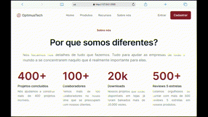
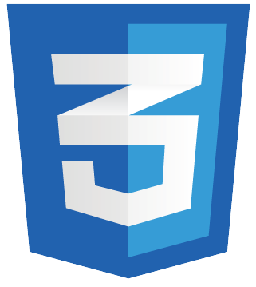

# Landing Page - OptimusTech

## 📖 Descrição

Este projeto é um desafio #7DaysOfCode que tem o objetivo de criar uma página para uma empresa de TI onde está empresa deseja realizar novas contratações.

## 🎯 Objetivo

° Desenvolver uma página destinada a novas contratações, seguindo o layout disponibilizado no Figma.

## 🛠️ Tecnologias 

## ⌛ Status do Projeto

Concluído